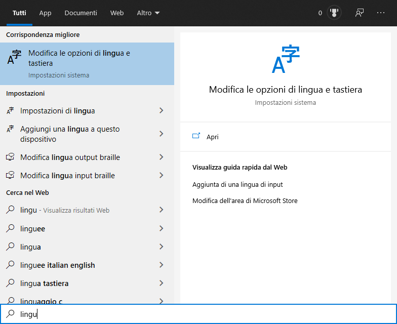
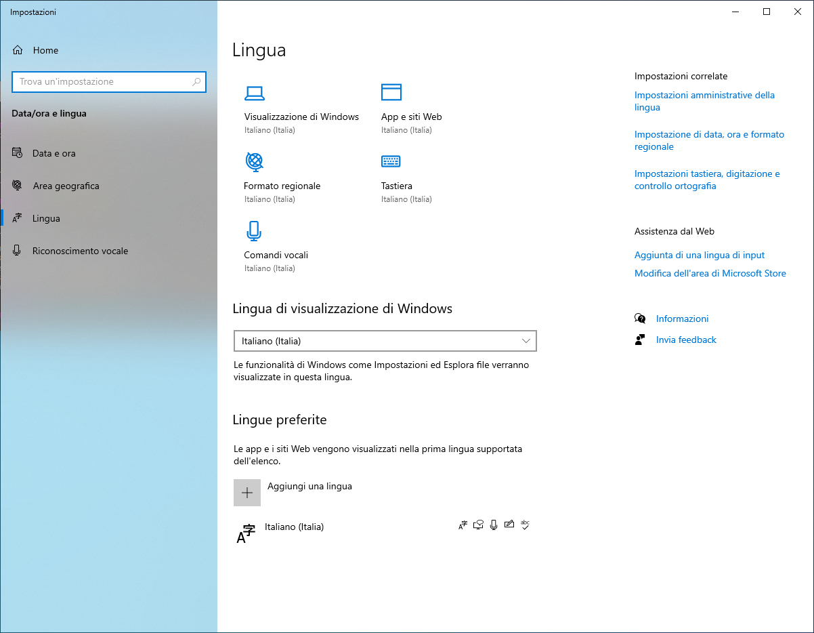
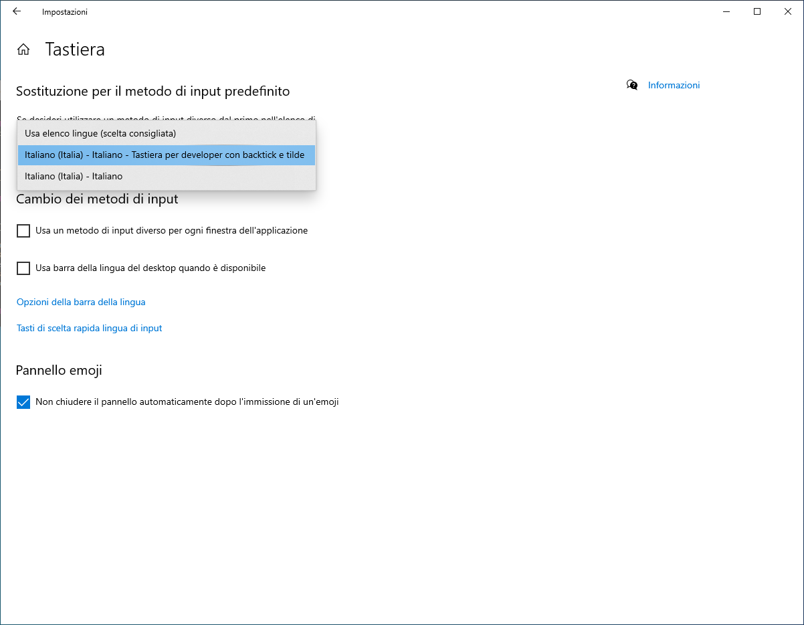

# Layout tastiera Italiana con Backtick e tilde

Stufo di dovermi sempre consumare le mani su windows utilizzando alt ed il tastierino numerico per digitare questi due caratteri ho creato un layout tastiera custom.

Dato che su ubuntu questi due caratteri potevano venire digitati semplicemente con le seguenti combinazioni

- ALT GR + ' = `
- ALT GR + ì = ~

come conseguenza ho cercato un modo per customizzare la tastiera di windows.

Considerando che continuo a scordarmi come fare questa cosa, dato che configuro un pc per lavorare una volta all'anno circa, e che non ho un posto decente dove fare il backup di questo installer ottenuto con [MSKLC](ottenibile a questo link https://download.microsoft.com/download/6/f/5/6f5ce43a-e892-4fd1-b9a6-1a0cbb64e6e2/MSKLC.exe ) ho deciso di metterlo qui a beneficio di tutti i poveri programmatori italiani che non hanno questi due utilissimi caratteri sulla tastiera...

## Setup

1. Avviate il setup utilizzando setup.exe (davvero sì! setup.exe!!!) ed installate il layout
2. Cercate le opzioni di lingua 
3. Aprite le opzioni tastiera 
4. Selezionate il nuovo layout 
5. Fate finalmente pace col tastierino numerico! :smile:
